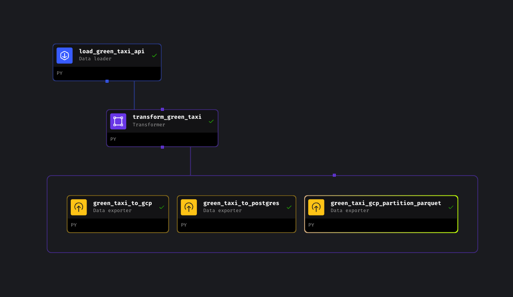

## Data Engineering Zoomcamp - Week 2 &#128640;

## Let's get started 

The project is started by cloning the repo:

```bash
git clone https://github.com/mage-ai/mage-zoomcamp.git mage-zoomcamp
```
The details of setting up the containers can be found in the [github repo of mage for DE Zoomcamp 2024](https://github.com/mage-ai/mage-zoomcamp).

## Using Mage.AI as the workflow orchestration tools &#128295;
 
- Testing of block in real-time has cut down significant amount of time in switching platforms.
- Crafting an ETL pipeline from API to Google Cloud Storage as .csv file or partitioned parquet file using pyarrow. 
- Ease of deployment of Mage through Terraform and Google Cloud.
- Harnessing the paramerizated execution and backfill capability of Mage.

## The Week-2 Homework 	&#128221;

### Question 1: Data Loading
  - The block that for loading data from the API can be found in [loader_block directory directory](./loader_block). 
  - The url: https://github.com/DataTalksClub/nyc-tlc-data/releases/tag/green. Copy the address of the month 10 (October), turn https://github.com/DataTalksClub/nyc-tlc-data/releases/download/green/green_tripdata_2020-10.csv.gz (Use this for data loading in Mage)
  - The result upon execution from the block in Mage:
  
  - There are total of 266855 rows with 20 columns.

### Question 2: Data Transformation
  - The block that for loading data from the API can be found in [transformer_block directory directory](./transformer_block). 
  - The result upon execution from the block in Mage:
  
  - There are total of 139370 rows with 21 columns.

### Question 3: Data Transformation
  - data['lpep_pickup_date'] = data['lpep_pickup_datetime'].dt.date is used to creates a new column lpep_pickup_date by converting lpep_pickup_datetime to a date.

### Question 4: Data Transformation
  - 2 existing values of VendorID in the dataset (1,2).

### Question 5: Data Transformation
  - 4 columns need to be renamed to snake case.

### Question 6: Data Exporting
  - There are 3 blocks to be executed after the transformation.
  - Left block: green_taxi_to_gcp save .csv file to GCS.
  - Middle block: green_taxi_to_postfres save data to postgres.
  - Right block: green_taxi_gcp_partition_parquet partition and save data into .parquet by date.
    

    

   - Total of 95 folders are created upon partitioned.