## Data Engineering Zoomcamp - Week 3 &#128640;

## Let's get started 

The project can be accessed through [week-3 module of DE Zoomcamp 2024](https://github.com/DataTalksClub/data-engineering-zoomcamp/tree/main/03-data-warehouse)

## Data Warehouse and Bigquery &#128295;
 
- Data Warehouse is important for OLAP, useful for business intelligence and data science team. 
- Big Query is the serverless data warehouse solution.
- Partitioning and clustering are useful method to cut down the query time, thus saving cost in Big Query.
- Exposure towards ML modelling in Big Query which is never thought of.
- Multiple ways to [optimize query](https://www.youtube.com/watch?v=k81mLJVX08w&list=PL3MmuxUbc_hJed7dXYoJw8DoCuVHhGEQb) and [information on infrastructure of Big Query](https://www.youtube.com/watch?v=eduHi1inM4s&list=PL3MmuxUbc_hJed7dXYoJw8DoCuVHhGEQb)

- The [web_to_gcs_parquet.py](web_to_gcs_parquet.py), [basic_bigquery.sql](basic_bigquery.sql) and [ml_bigquery.sql](ml_bigquery.sql) are customized to suit my own project-id in GCP.

## The Week-3 Homework 	&#128221;

### Creating External and Materialized Table

* Prior the creation of table in dataset of Big Query, the data is ingested to Google Cloud Storage directly using the [python script](./homework/web_green_taxi_to_gcs.py). All the files are in parquet format and can be accessed at: https://www.nyc.gov/site/tlc/about/tlc-trip-record-data.page

* The SQL Query in data warehouse for the homework can accessed [here](./homework/green_taxi.sql)

* Before answering the question, the external table was created, referring the data from Google Gloud Storage.

  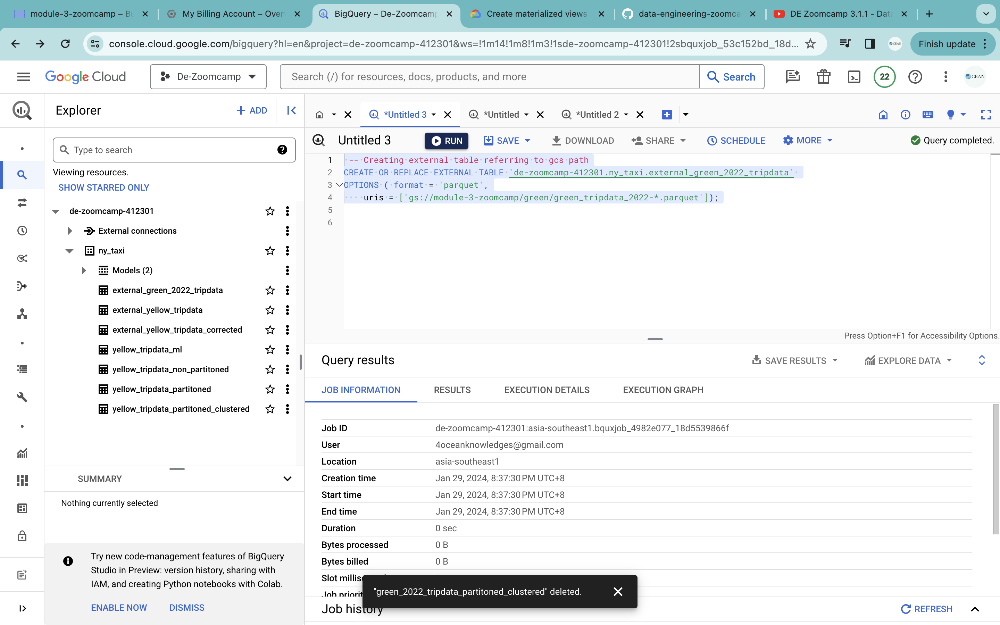 

* Create the materialized table from the external table, saving the data in internal system of Big Query 
  
  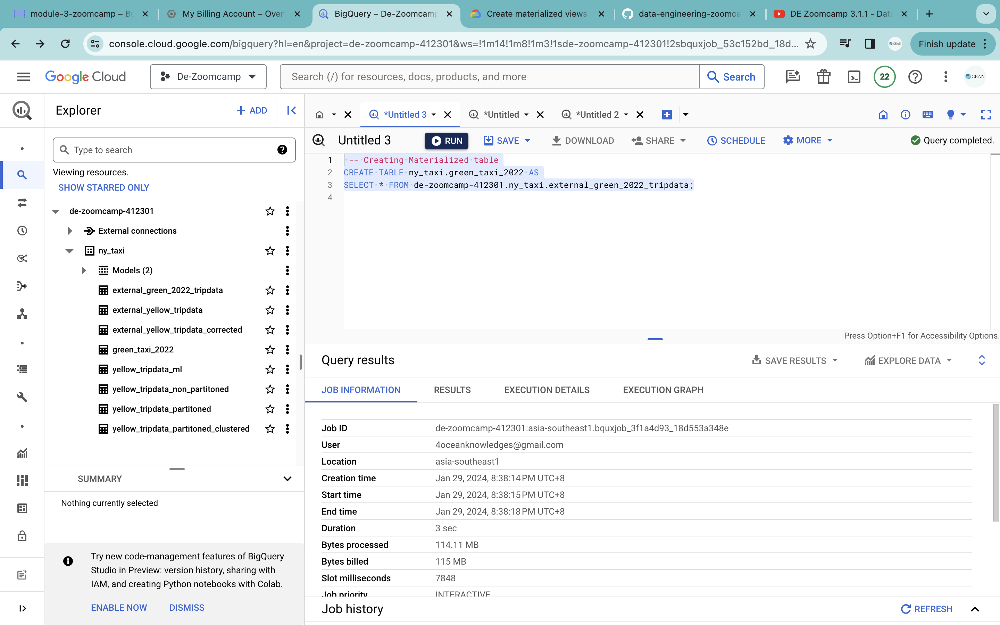

### Question 1

What is count of records for the 2022 Green Taxi Data??

* Get the records from materialized table, total of 840402 rows.

  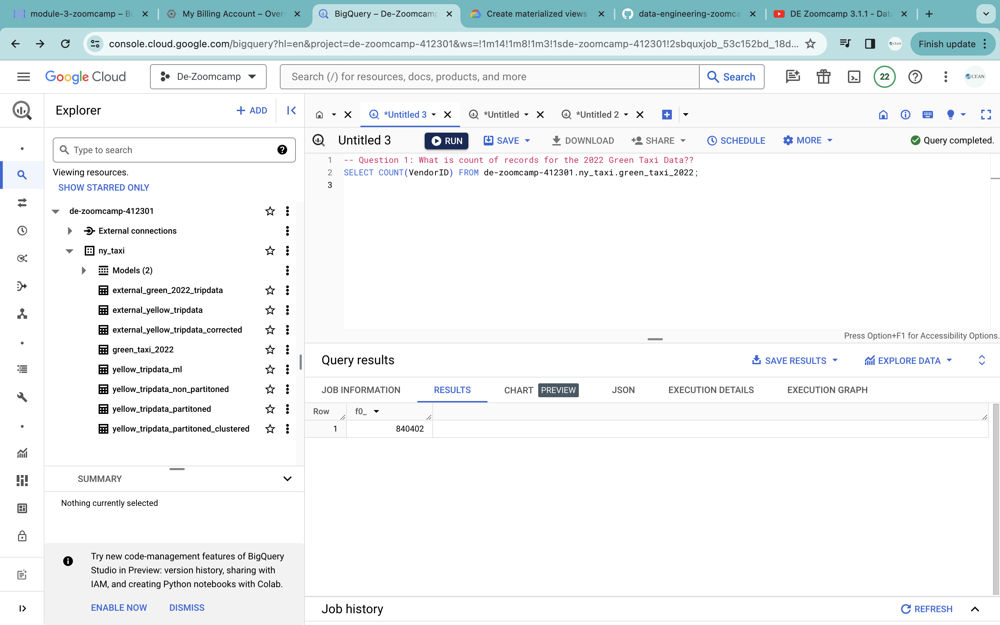

### Question 2

Write a query to count the distinct number of PULocationIDs for the entire dataset on both the tables.
What is the estimated amount of data that will be read when this query is executed on the External Table and the Table? 

* Answer are 0 MB for the External Table and 6.41MB for the Materialized Table

* Query estimate of 0 bytes (upper right corner) for External Table, because the data is residing outside the system in google cloud storage

  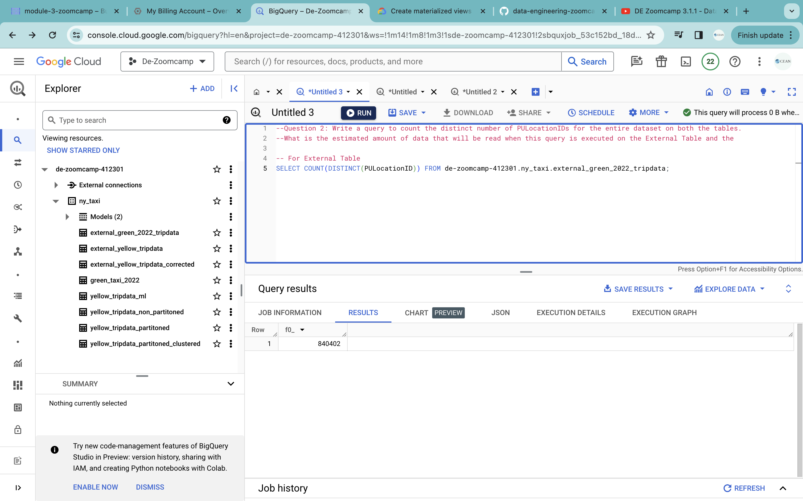

* Query estimate of 6.41MB (upper right corner) for Materialized Table, data is residing in the interanal system of Big Query

  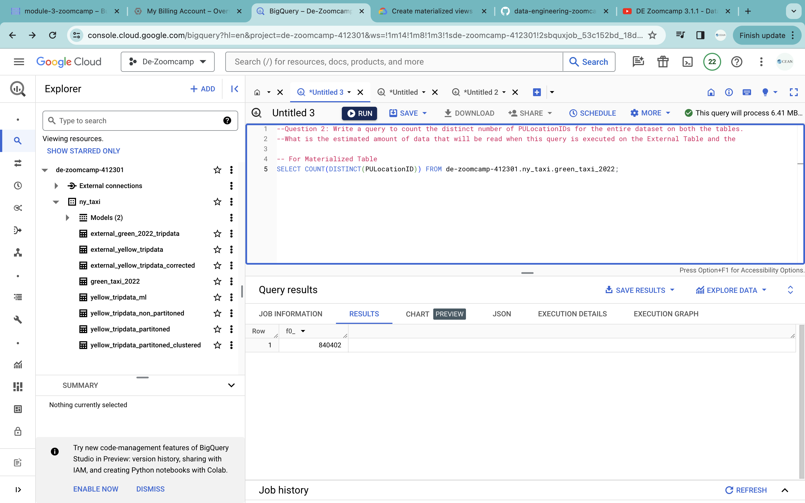

### Question 3

How many records have a fare_amount of 0?

* Get the records with fare_amount of 0, total of 1622

  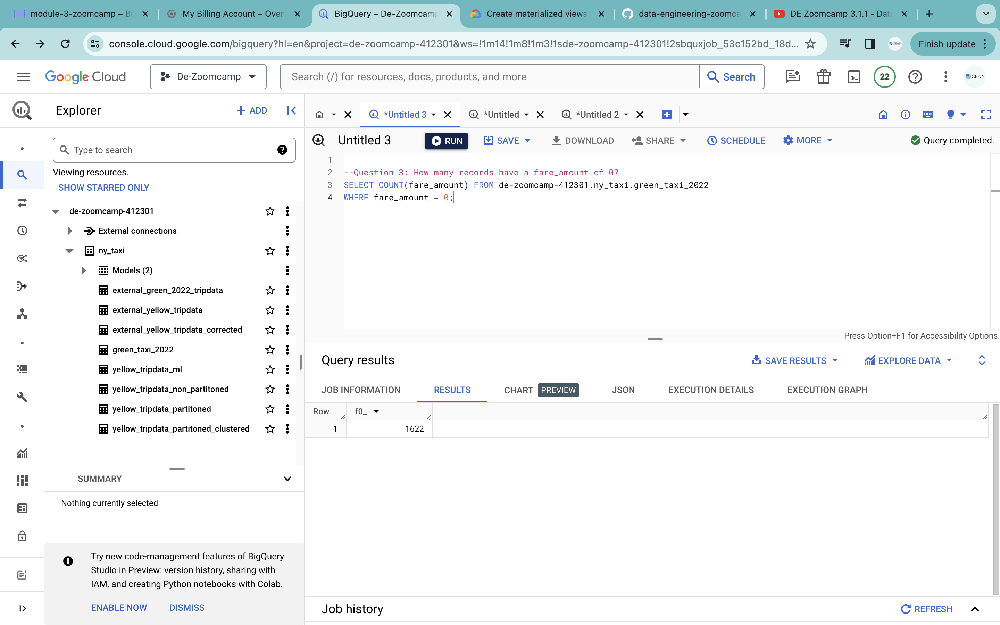

### Question 4

What is the best strategy to make an optimized table in Big Query if your query will always order the results by PUlocationID and filter based on lpep_pickup_datetime?

* Answer: Partition by lpep_pickup_datetime Cluster on PUlocationID

  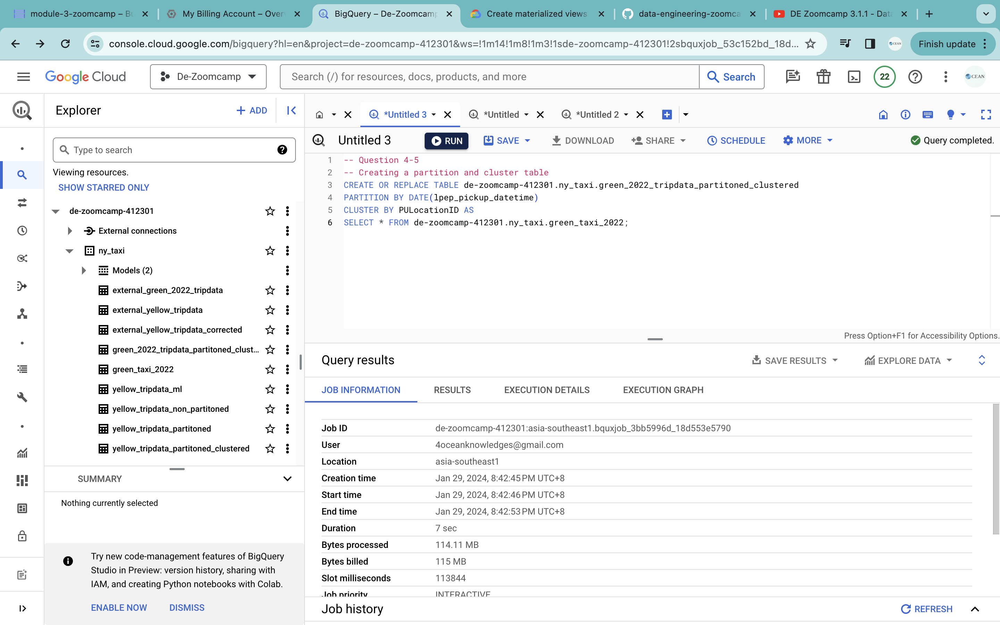

### Question 5

Write a query to retrieve the distinct PULocationID between lpep_pickup_datetime 06/01/2022 and 06/30/2022 (inclusive). Use the BQ table you created earlier in your from clause and note the estimated bytes. Now change the table in the from clause to the partitioned table you created for question 4 and note the estimated bytes processed. What are these values? Choose the answer which most closely matches.

* Answer: 12.82 MB for non-partitioned table and 1.12 MB for the partitioned table

* Non-partitioned table (~1.12 MB)
  
  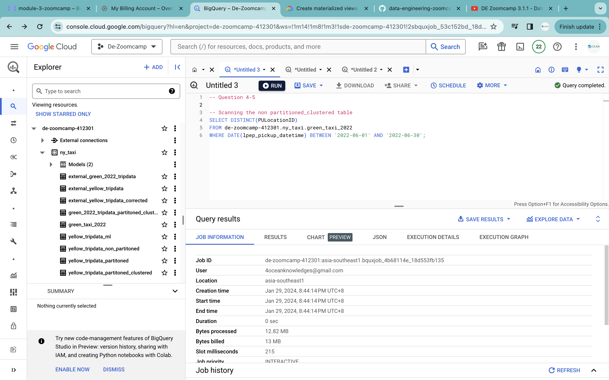

* Partitioned table (~12.82 MB)

  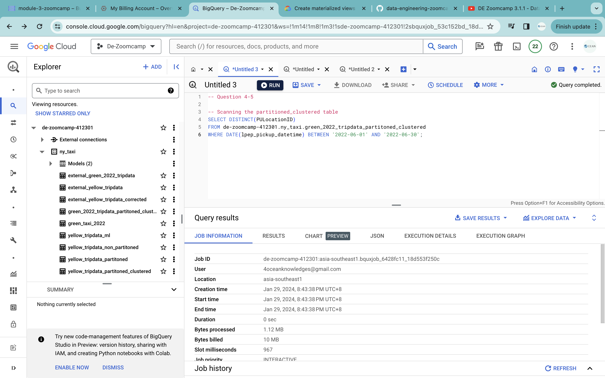

### Question 6:

Where is the data stored in the External Table you created?

* GCP Bucket

### Question 7:
It is best practice in Big Query to always cluster your data:

* False (No increase of efficiency if data size less than 1GB)

### Question 8:

No Points: Write a SELECT count(*) query FROM the materialized table you created. How many bytes does it estimate will be read? Why?

Note: Column types for all files used in an External Table must have the same datatype. While an External Table may be created and shown in the side panel in Big Query, this will need to be validated by running a count query on the External Table to check if any errors occur.

* Estimate of 114.11 MB as reading all the column from the internal system of Big Query (Materialized Table)
  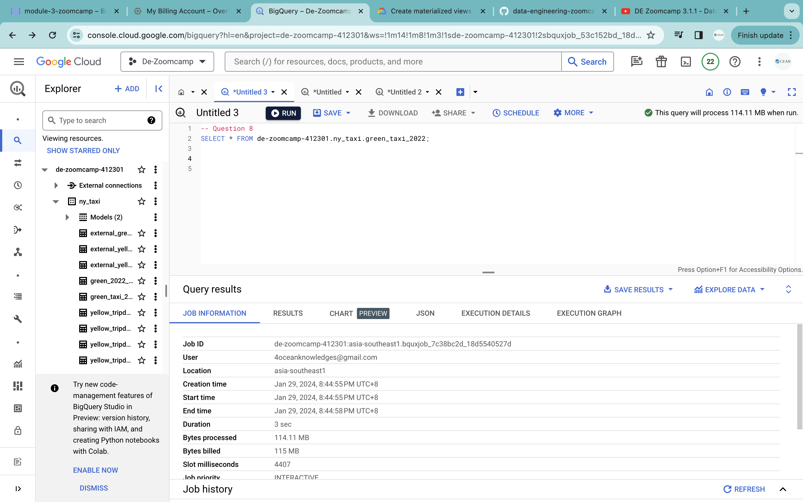

* Estimate of 0 MB as data stored in Google Cloud Storage (External Table)
  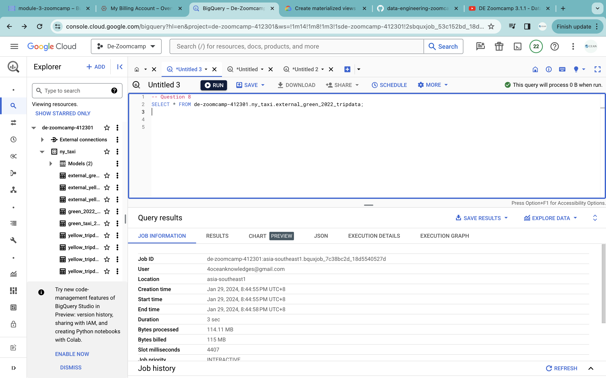