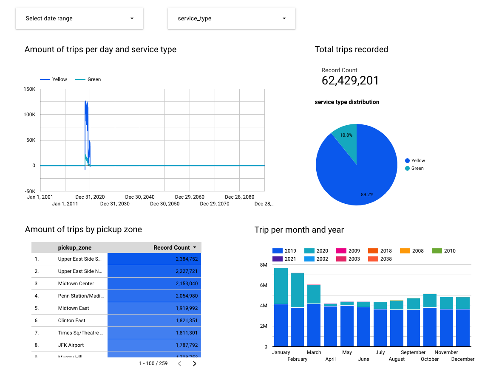
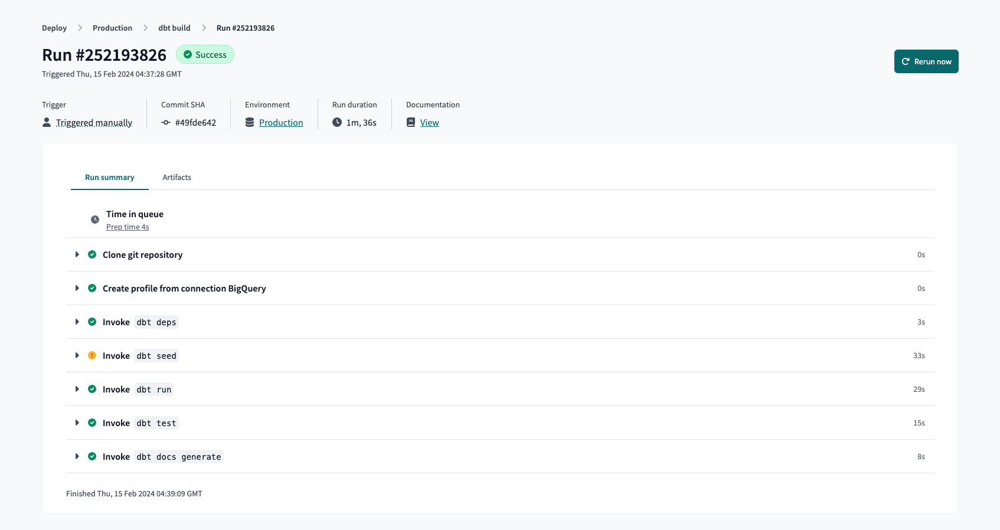
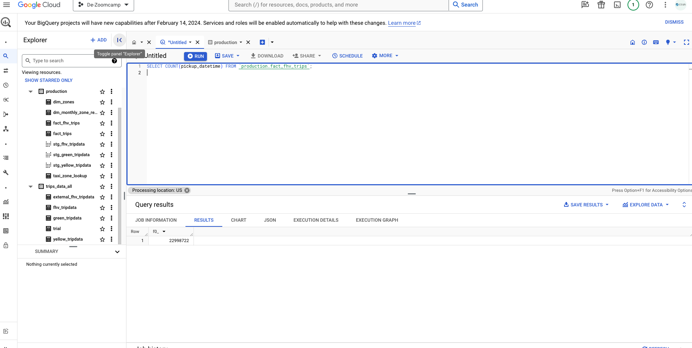
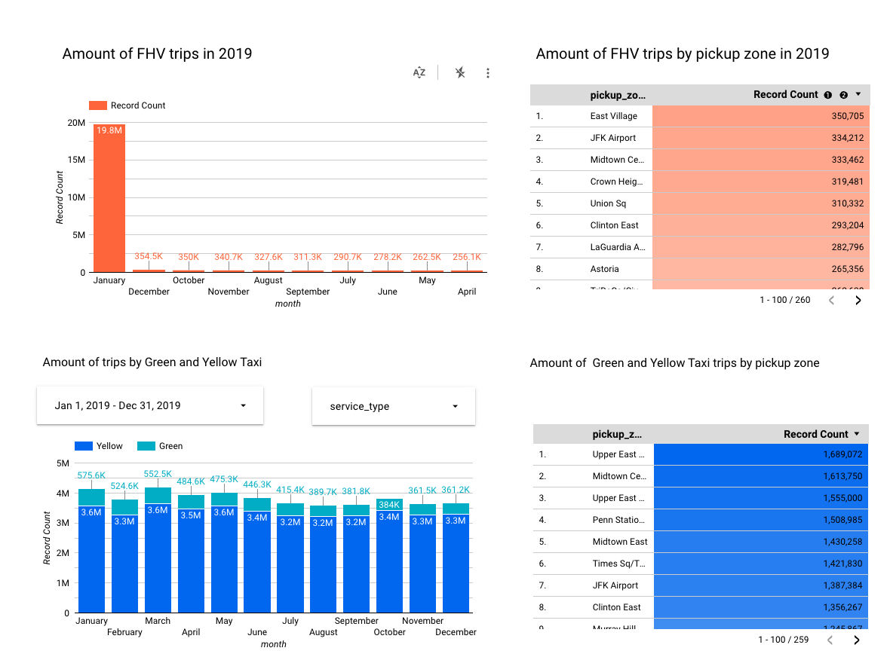

## Data Engineering Zoomcamp - Week 4 &#128640;

## Let's get started 

The project can be accessed through [week-4 module of DE Zoomcamp 2024](https://github.com/DataTalksClub/data-engineering-zoomcamp/tree/main/04-analytics-engineering)

## Analytic Engineering with dbt &#128295;

The note for this modules can be find at the medium article by me into two parts:
  
* [What is DBT and how to integrate it with BigQuery ? 🚀](https://medium.com/@kangzhiyong1999/what-is-dbt-and-how-to-integrate-it-with-bigquery-e7b3db7241ef)
* [From Testing/Documenting of dbt model to deployment in dbt cloud 🚀](https://medium.com/@kangzhiyong1999/from-testing-documenting-of-dbt-model-to-deployment-in-dbt-cloud-a6481c50aa64)

## Homework

## Question 1
What happens when we execute dbt build --vars '{'is_test_run':'true'}' You'll need to have completed the "Build the first dbt models" video.

Answer: "It applies only a limit 100 only to our staging models"

## Question 2
What is the code that our CI job will run?

Answer: "The code from a development branch requesting a merge to main"

## Question 3
What is the count of records in the model fact_fhv_trips after running all dependencies with the test run variable disabled (:false)?
Create a staging model for the fhv data, similar to the ones made for yellow and green data. Add an additional filter for keeping only records with pickup time in year 2019. Do not add a deduplication step. Run this models without limits (is_test_run: false).

Create a core model similar to fact trips, but selecting from stg_fhv_tripdata and joining with dim_zones. Similar to what we've done in fact_trips, keep only records with known pickup and dropoff locations entries for pickup and dropoff locations. Run the dbt model without limits (is_test_run: false).

Answer: The code for creating the [staging models](./dbt_nytaxi/models/staging/stg_fhv_tripdata.sql) and [core models](./dbt_nytaxi/models/core/fact_fhv_trips.sql) can be accessed in the `dbt_nytaxi/models` directory.

Upon having the model tested, it is run in production as follow:

We then query the number of records in BigQuery as follow:

NOTE: The SQL query to load fhv_trip data can be found [here](homework.sql). The number of records are '22998722'

## Question 4
What is the service that had the most rides during the month of July 2019 month with the biggest amount of rides after building a tile for the fact_fhv_trips table?

Create a dashboard with some tiles that you find interesting to explore the data. One tile should show the amount of trips per month, as done in the videos for fact_trips, including the fact_fhv_trips data.

Answer: Based on the tiles created using two different data source, one from homework and one from video as follow:

The 'Yellow' taxi have the highest records in July 2019.

