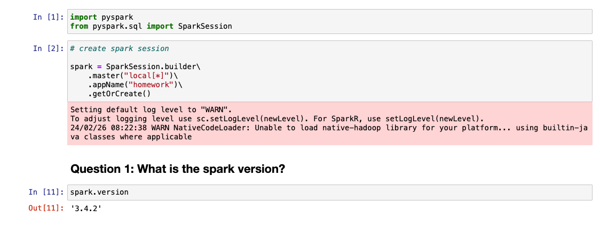
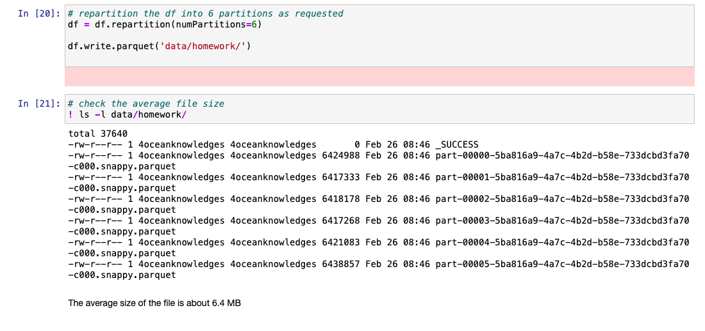
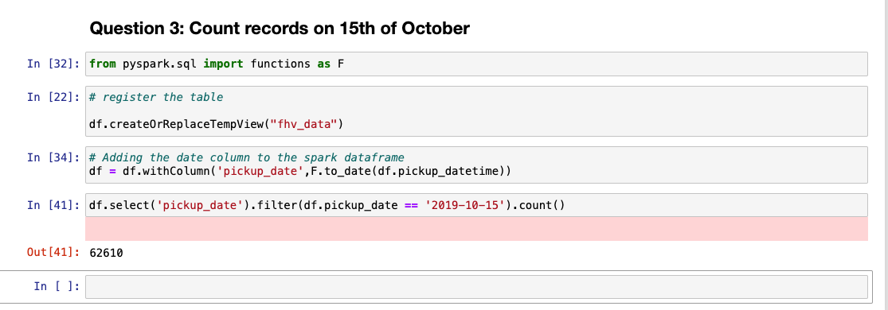
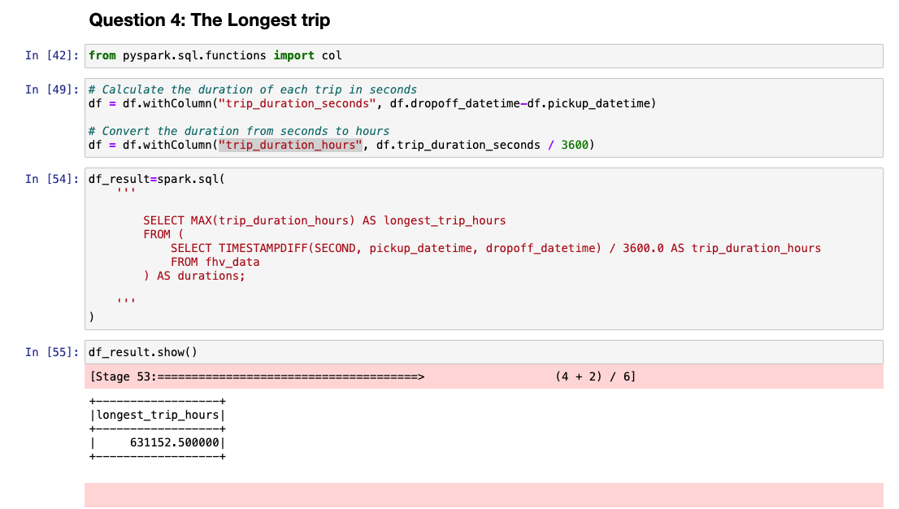
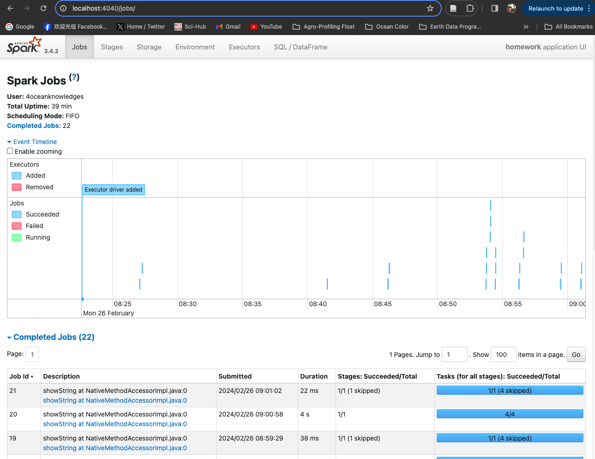
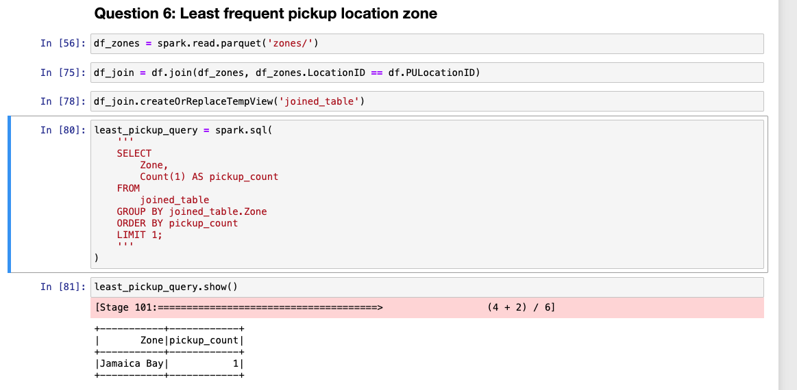

## Data Engineering Zoomcamp - Week 4 &#128640;

## Let's get started 

The project can be accessed through [Week-5 module of DE Zoomcamp 2024](https://github.com/DataTalksClub/data-engineering-zoomcamp/tree/main/05-batch)

## Batch Processing with Apache Spark &#128295;

The note for this modules can be find at the medium article by me into four parts:
  
* [How to Run Spark on Ubuntu Machine in Google Cloud (PySpark: Basic) 🚀](https://medium.com/@kangzhiyong1999/how-to-run-spark-on-ubuntu-machine-in-google-cloud-pyspark-basic-24e277083d5a)
* [Understand the Spark Cluster: Spark DataFrame and Spark SQL with PySpark 🚀](https://medium.com/@kangzhiyong1999/understand-the-spark-cluster-spark-dataframe-and-spark-sql-with-pyspark-efab224fd1e6)
* [Resilient Distributed Dataset in Spark 🚀](https://medium.com/@kangzhiyong1999/resilient-distributed-dataset-in-spark-cfc7eba05a05)
* [Apache Spark in Google Cloud 🚀](https://medium.com/@kangzhiyong1999/apache-spark-in-google-cloud-58b3a5c09ad1)

## Homework

## Question 1: Spark version 

I have installed the latest version of Apache Spark due to the compatability issue with pandas module. We can check the version of Spark by first creating the SparkSession as follow

The spark version is 3.4.2

## Question 2: FHV October 2019 partition size 

The average file size is about 6MB.

## Question 3: Count records on 15th of October 

The records on 15th October is 62,610.

## Question 4: The Longest trip

The longest trip was 631,152.50 Hours

## Question 5: Spark UI port

The Spark UI port is localhost:4040

## Question 6: Least frequent pickup location zone

The least frequent pickup location zone is Jamaica Bay with record of 1