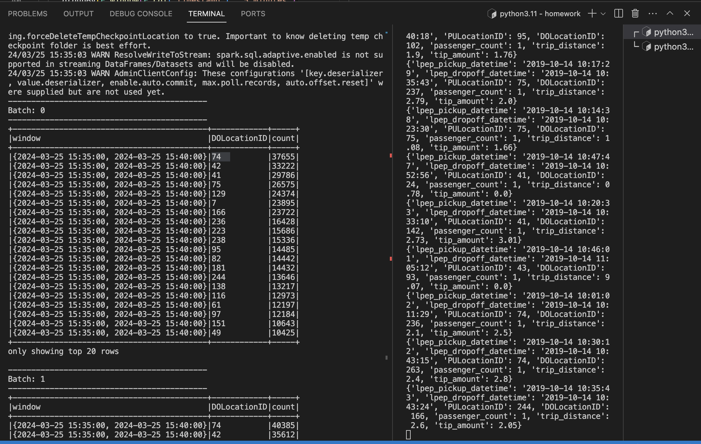

## Data Engineering Zoomcamp - Week 6 &#128640;

## Let's get started 

The project can be accessed through [Week-6 module of DE Zoomcamp 2024](https://github.com/DataTalksClub/data-engineering-zoomcamp/tree/main/06-streaming)

## Stream Processing with Apache Kafka &#128295;

The note for this modules can be find at the medium article by me into four parts:
  
* [How Apache Kafka works internally along with its configuration ? 👨🏻‍💻](https://medium.com/@kangzhiyong1999/how-apache-kafka-works-internally-along-with-its-configuration-4ec21f77a549)
* [Learning Stream Processing in Kafka👨🏻‍💻](https://medium.com/@kangzhiyong1999/learning-stream-processing-in-kafka-67439d878e40)

## Homework

## Question 1: 

Use the command below after running `docker compose up -d` to check the version of redpanda

```
alias rpk="docker exec -ti redpanda-1 rpk"
rpk version

```

Answer: "v22.3.5 (rev 28b2443)"

## Question 2: Creating a topic

```
rpk topic create test-topic --partitions 2 

```
Answer: It give the output of "TOPIC       STATUS
test-topic  OK"

## Question 3: Connecting to the Kafka server

We can add the print statement in the last line of if running in script and it print out "True"

Answer: "True"

## Question 4: Sending data to the stream
Took about 0.55 seconds
Answer: Sending the messages

## Question 5: Time to send data 

The script for ingesting data can be found in [here](./homework/green_producer.py) refering to some of the core idea from [nenalukic](https://github.com/nenalukic/streaming-kafka/blob/main/homework/green_producer.py).

Answer: Total time used was about 84.72 seconds

## Question 6: Parsing the data

* Before parsing
`Row(key=None, value=bytearray(b'{"lpep_pickup_datetime":"2019-10-06 10:34:04","lpep_dropoff_datetime":"2019-10-06 10:41:03","PULocationID":97,"DOLocationID":33,"passenger_count":1,"trip_distance":1.31,"tip_amount":1.0}'), topic='green-trips', partition=0, offset=794036, timestamp=datetime.datetime(2024, 3, 25, 15, 30, 20, 461000), timestampType=0)`

* After parsing (Answer)
`Row(lpep_pickup_datetime='2019-10-04 17:57:52', lpep_dropoff_datetime='2019-10-04 18:10:24', PULocationID=185, DOLocationID=51, passenger_count=1.0, trip_distance=3.28, tip_amount=0.0)`

## Question 7: Most popular destination


The most popular destination was with 74 DOLocation ID as figure above.