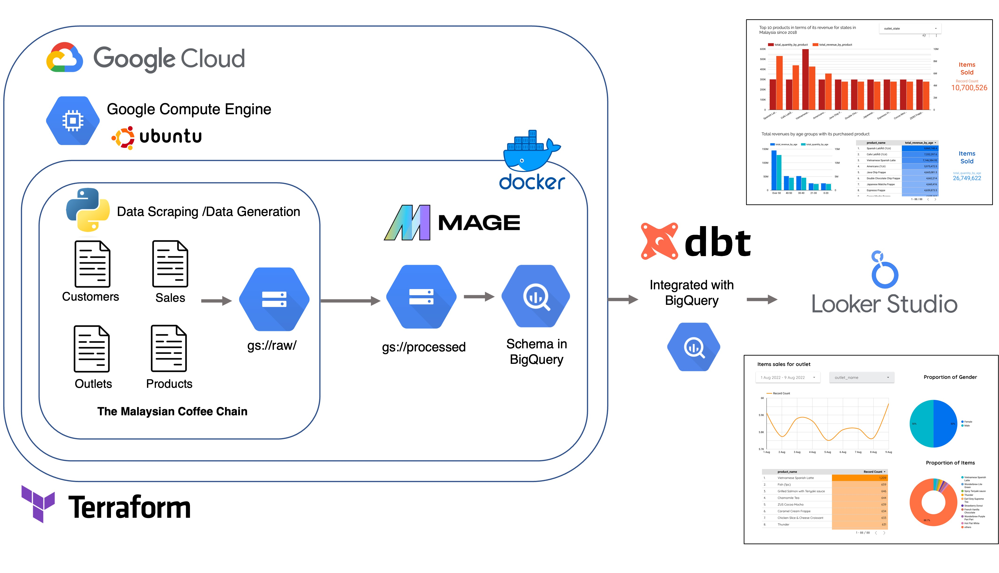
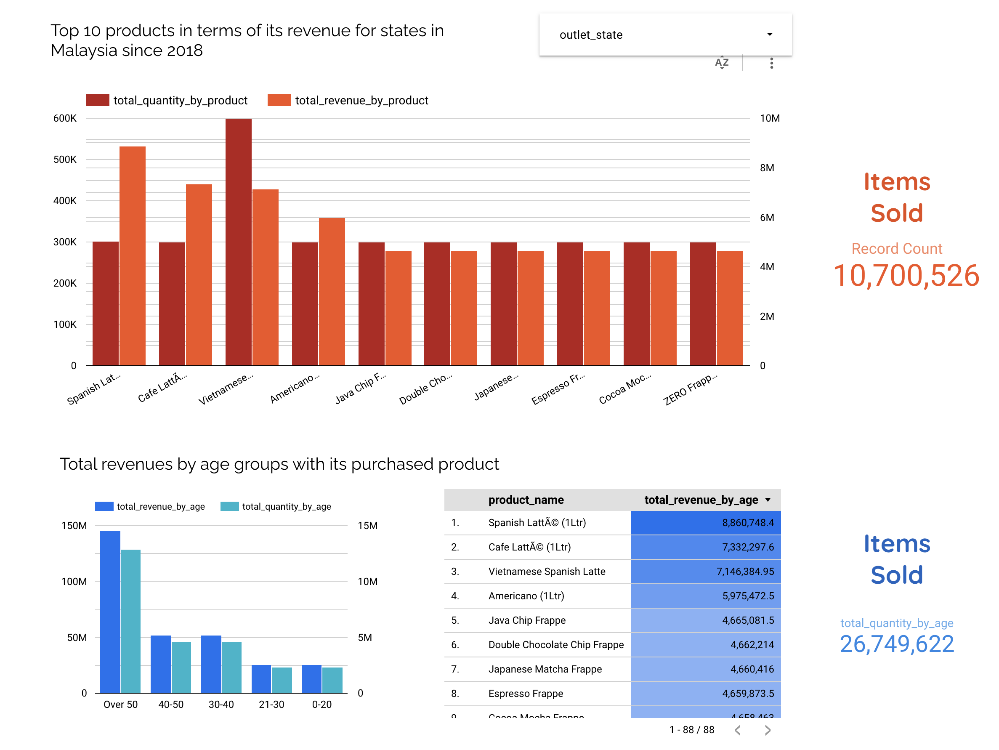
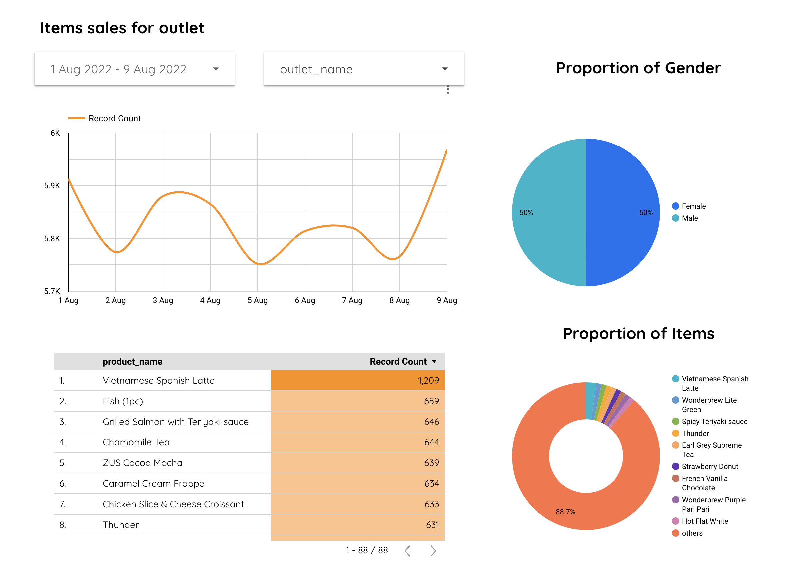

# Project A for DE Zoomcamp: The Malaysian's Coffee &#9749;

## Overview of the Project: Batch Processing 

“A NECESSITY, NOT A LUXURY” , has been the tagline for the Malaysia home grown tech coffee chain named ZUS coffee since 2019, growing rapidly across the nations with total of 4+ millions cups of coffee sold to date through their own mobile application. It’s absolutely a great success with tons of effort putting in by their employee. In regards, it really struck my interest to have the sales data on their coffee chain as it will probably a great dataset for data engineering project. Hence, the whole project started with web scarping of their existing outlet and products whilst generating fake sales data using python modules. The overall workflow is illustrated as figure above. 

* For web scraping and data generation, check out [data_generation](./data_generation/) folder.
* For setting up resources in Google Cloud Platform, check out [terraform](./terraform/) folder.
* For setting up the data orchestration tools in google compute engine, download docker engine for ubuntu, follow the instrution from the official docker documentation [here](https://docs.docker.com/engine/install/ubuntu/) prior installing the mage.ai tools. 
* For data modelling using dbt cloud, check out the [dbt_coffee_chain](./dbt_coffee_chain) folder. 

## Dashboard for monitoring sales

The first dashboard was built to visualise the total revenue and item sold by outlets in each state of Malaysia (upper panel). The dropdown menu allows user customise their own desired location and generate the associated graph. The lower panel is then the pre-liminary analysis of the overal purchase done by customers based on their age groups. It could be potentially used for the product development and targetted marketing for different departtments.

The second dashboard is the details of items sold for each outlet with customized period. It will be useful for generating monthly report and identify the favorite products for certain outlet, potentially help in supply chain management to stock up the right products and cutting down product wastage.  