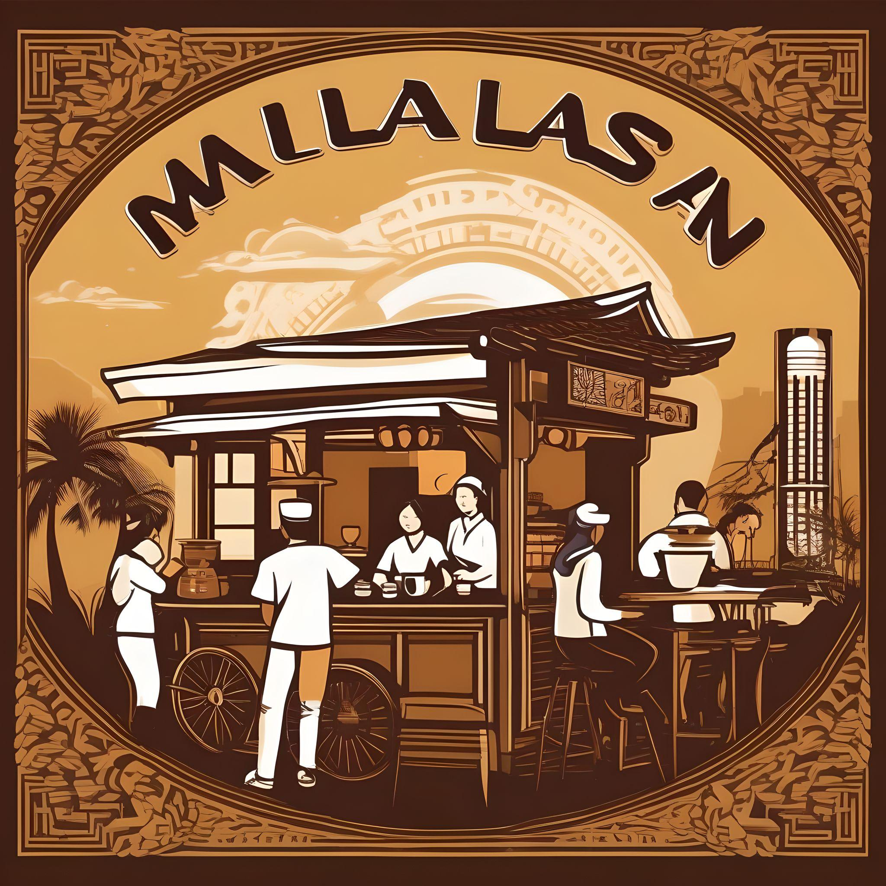
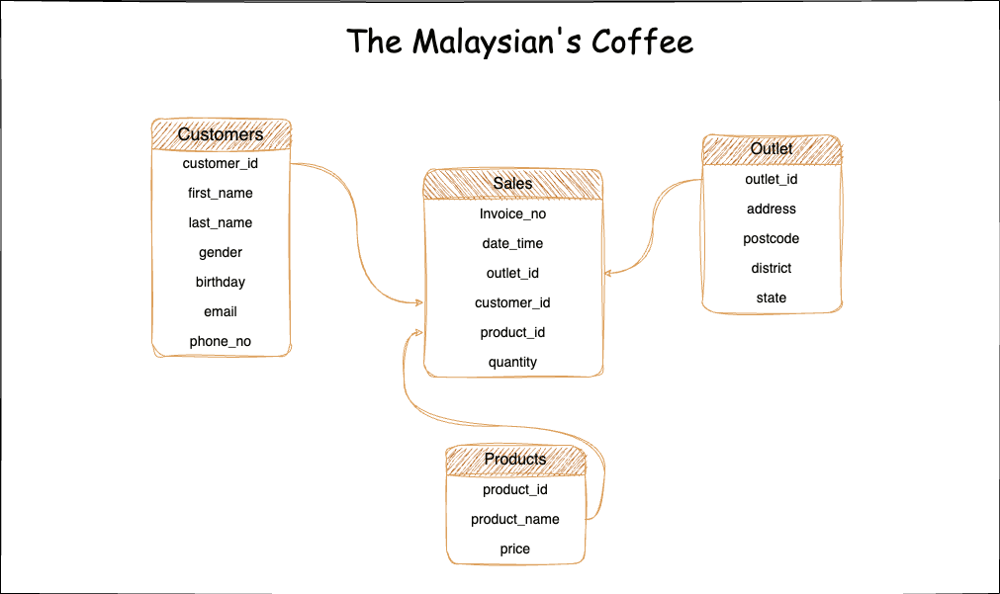

# Project A for DE Zoomcamp: The Malaysian's Coffee &#9749;


## Generating the data needed



Overall, the data model look like figure above which made up of four major tables, the customers, sales, products and outlet with its own unique keys. All the data can be generated via the python script in `./data_generation/` directory. Specifically, the  [`generate_outlet.py`](./data_generation/generate_outlet.py) and [`generate_outlet.py`](./data_generation/generate_outlet.py) are the script that scrap the data of Malaysian tech driven coffee chain called [ZUS coffee, Malaysia](https://zuscoffee.com/menu/). 

The scraping of data can be run in terminal with python installed

```{Python}

# to scrap the product name and price
python data_generation/generate_product.py --output /path/to/destination

```

```{Python}

# to scrap the outlet name and address
python data_generation/generate_outlet.py --output /path/to/destination

```

Next, we generate the customer database by specifying number of records and seeds to make sure not replication.

```{python}

python data_generation/generate_customer_database.py --seed 10 --output /path/to/destination/ --number 500000 --date_string "2024-02-24"

```

To prepare the data, we first need to get outlet, product and customer data ready prior running the `generate_coffee_order.py` file in `./data_generation/`

```{python}

python data_generation/generate_coffee_order.py --seed 10 --output /path/to/destination/ --number 650000 --date_string "2024-02-24"

```     