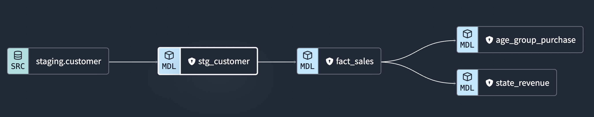
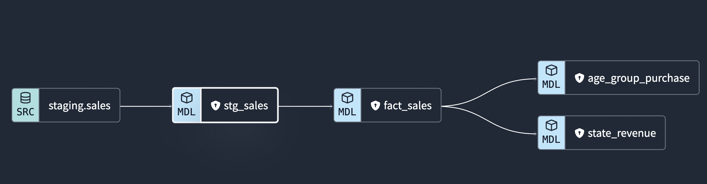
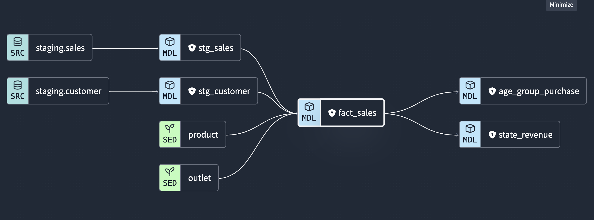

## Running the data modelling in dbt cloud

For this project, the development stage of the data modelling was done in dbt cloud with a connection to BigQuery. Overall, 7 models are built with 2 seeds, 2 staging models and 3 core models. The documentation on dbt for this project can be accessed [here](https://cloud.getdbt.com/accounts/239923/jobs/516517/docs/#!/overview).

## dbt seed

There are two seed files in `.csv` format called `outlet.csv` and `product.csv`. Prior running the core model, seeds should be run as all the core model rely on the seeds file. The column types of both seeds file is also defined in the [dbt_project.yml](./dbt_project.yml).

## staging model 

For staging models, there are two models that create a `view ` from the existing data in BigQuery. Check out the configuration file [here](./models/staging/schema.yml). In short, it create a staging model of sales and customer data that have been ingested to bigquery previously using MAGE as follow. It will be later used for the development of core model

## core model

For core models, there are three models build which the `fact_sales` model based on the seeds file and staging models we build earlier. The `age_group_purchase` and `state_revenue` were then built on top of the `fact_sales` table. You may check out the dbt file [here](./models/core/)

## Running the dbt commands in cloud 

Run the following commands while sheduling a job in dbt cloud
- dbt seed
- dbt run
- dbt test

There are multiple test wrote to make sure the data modelling is performed correctly by having a `test` command. 

### Resources:
- Learn more about dbt [in the docs](https://docs.getdbt.com/docs/introduction)
- Check out [Discourse](https://discourse.getdbt.com/) for commonly asked questions and answers
- Join the [dbt community](https://getdbt.com/community) to learn from other analytics engineers
- Find [dbt events](https://events.getdbt.com) near you
- Check out [the blog](https://blog.getdbt.com/) for the latest news on dbt's development and best practices
