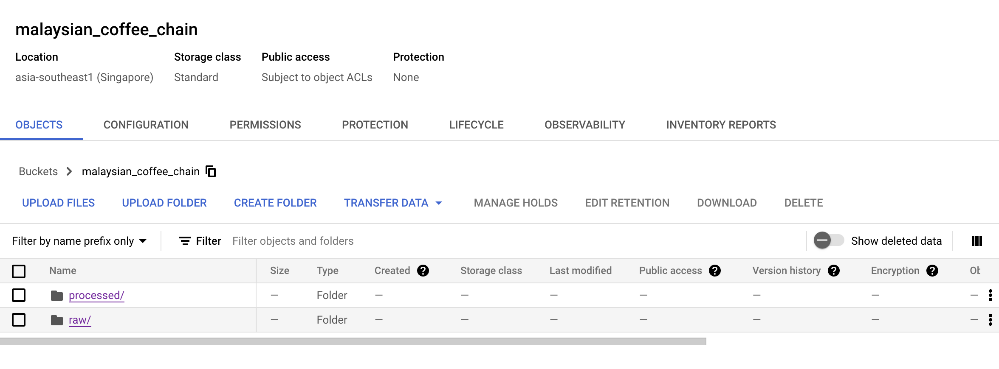
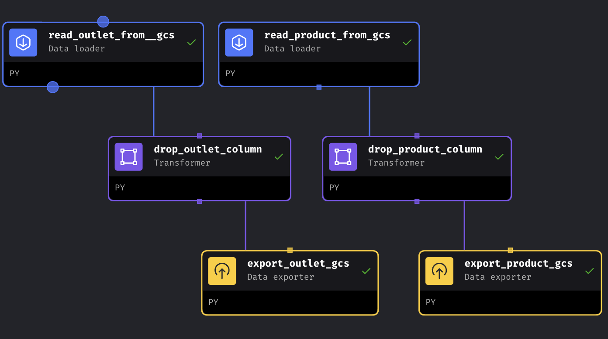
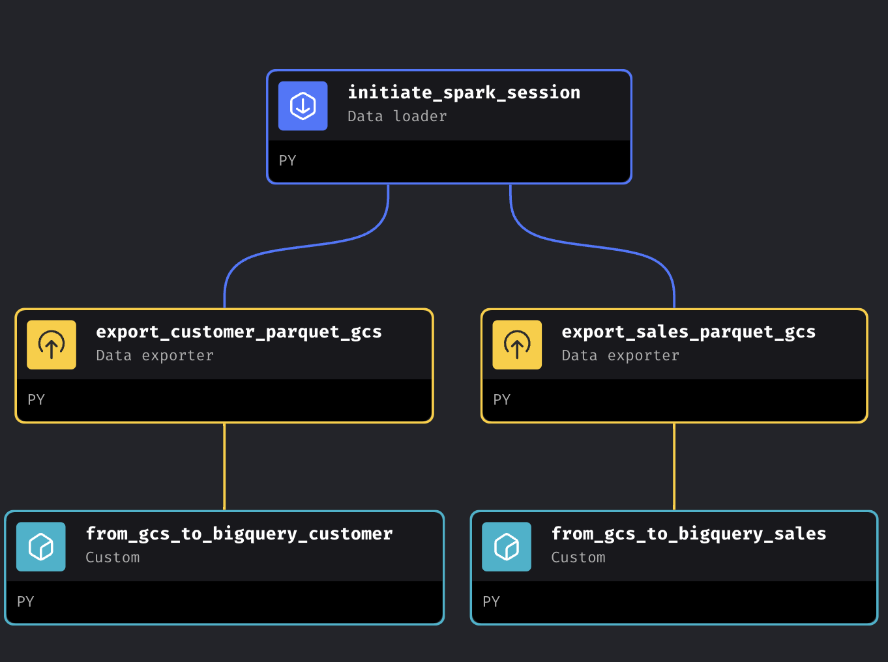
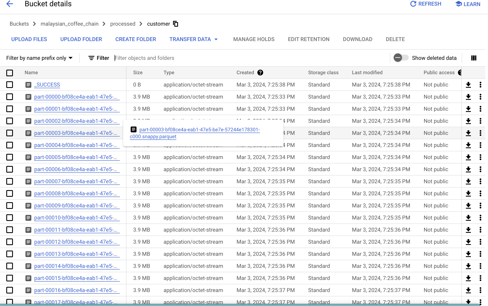
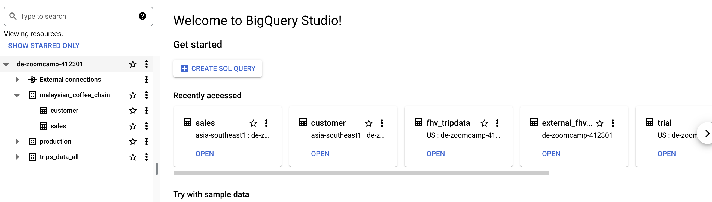

## MAGE as data orchestration tool


As the visualisation above, MAGE is run inside a docker container to manipulate the data workflow. In general, there is two pipeline built to ingest the small size data called `outlet.csv` and `product.csv` as well as the pipeline in charge of the larger file, the `customer.csv` and `sales.csv`

For the data ingestion of smaller file size, it was ingested from the GCS bucket in the `raw` directory, transformed and eventually sit at `processed` directory. Both of this file will be the seeds file while building the dbt model.





In contrast, the larger file size required extra step or tools to perform the ETL. You might notice the `pyspark` module in the `requirements.txt` file. In this project, we doesn't submit the spark job to the cluster in AWS, Dataproc or Databrick offered by different cloud service provider, but rather run in a local mode. Although it's not a good pratice as it might crash the virtual machine in cloud when the data volumne is getting bigger and the driver in Spark no longer able to handle the task in Spark. However, this project is for demonstration purpose and the file size is just nice to be processed in local spark session. However, you can always configure the spark in `metadata.yml` file to set your master node in the cluster. 

In my case, I want the fine control and access on spark, hence I have the configuration as follow:

```
spark_config:
  use_custom_session: true
  # The variable name to set in kwargs['context'],
  # e.g. kwargs['context']['spark'] = spark_session
  custom_session_var_name: 'spark'
```

Other than that, I also set up a connection with bigquery by downloading the connector as follow:

```
$ mkdir lib

$ wget https://storage.googleapis.com/hadoop-lib/gcs/gcs-connector-hadoop3-latest.jar
```
The overall pipeline looks as figure below:



We instantiate a spark session locally on the virtual machine and load the data from GCS at the `raw` directory, carry out data trasnformation (check out [here](./MALAYSIAN_COFFEE/data_exporters/export_customer_parquet_gcs.py)) and eventually save to the `processed` directory as the `.parquet` file.



The `parquet` file for both customers and sales data are then load to the BigQuery Table as `sales` and `customers` under the schema of `malaysian_coffee_chain`



The scheduling of pipeline is then done depends on the generation of new data