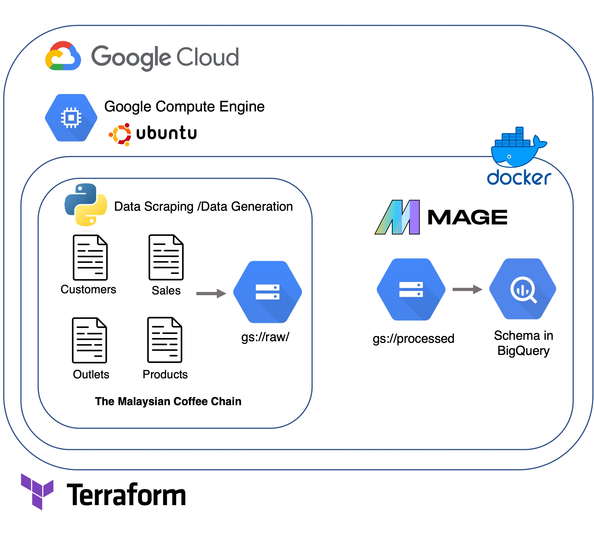

## Setting up resources in Goolge Cloud Platform 



In this project, the resources being used includes google compute engine, google cloud storage, and BigQuery. In the `main.tf`, we defined the recources that we planned to launch upon running the script while the  `variable.tf` file stored the variable that will be accessed in the `main.tf `. It include the path to the credentials key, bucket name in google cloud storage, schema in bigquery and compute engine name. Other variable like location and project name are also defined prior running the command as below

* Instantitae terrafrom
```
$ terraform init
```

* Check out the resouces that will be launched and potential error
```
$ terraform plan
```

* Apply and run the resouces in GCP
```
$ terraform apply
```

* To stop and clear all the service, run
``` 
$ terraform destroy
```