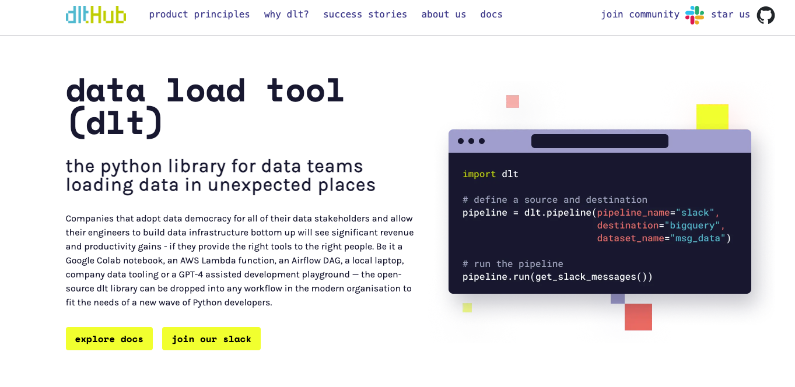
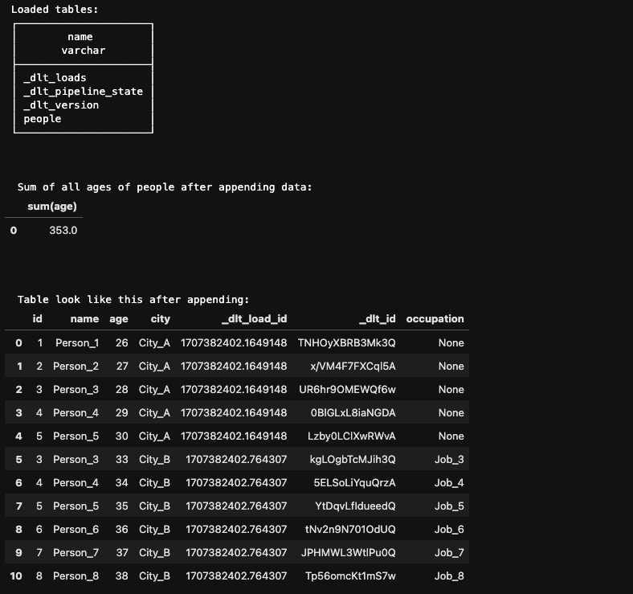
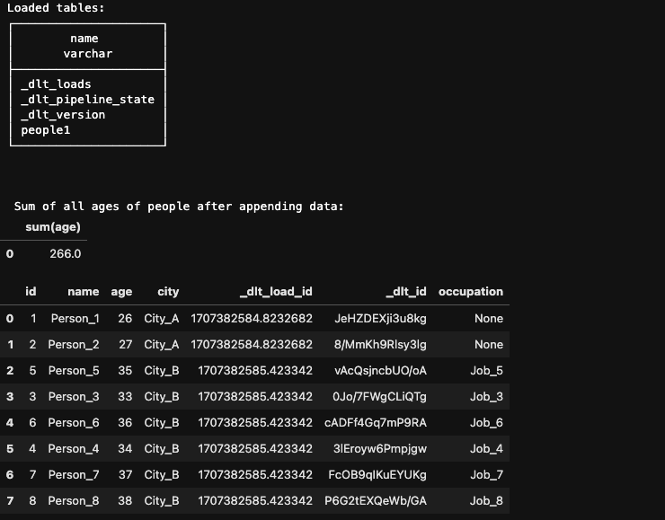

## Data Engineering Zoomcamp - Workshop 1 &#128640;

## Let's get started 

The project can be accessed through [DE Zoomcamp 2024 Workshop 1: data load tool (dlt)](https://github.com/DataTalksClub/data-engineering-zoomcamp/blob/main/cohorts/2024/workshops/dlt.md)

## Data Load Tool (dlt)


- More information on data load tool can be accessed via their official website [here](https://dlthub.com/)

- Use generator as the approach in memory management. It prevent loading of whole data in a big chunk that crash the machine, totally a nightmare! 
- Amazed by how easy and simple it is for parsing JSON data into database using the dlt library.
- Get introduced to DuckDB, an in-process SQL OLAP database management system.


## Workshop Homework &#128221;
The code for homework can be access [here](./homework_starter.ipynb).

## Question 1
Question 1: What is the sum of the outputs of the generator for limit = 5?

The answer can be obtained by `list(generator)` to load data in memory as follow:

```python

import numpy as np
limit = 5
generator = square_root_generator(limit)
np.array(list(generator)).sum()

```
The answer returned is 8.382332347441762

## Question 2
Question 2: What is the 13th number yielded by the generator?

Similar concept used in question 1 can be applied by accessing the last element 

```python
limit = 13
generator = square_root_generator(limit)
list(generator)[-1]

```
The answer is 3.605551275463989

## Question 3
Question 3: Append the 2 generators. After correctly appending the data, calculate the sum of all ages of people.

First create the pipeline using dlt library, name dataset_name as `homework`, table_name as `people`, write_diposition as `append` for 2nd generator.

```python 
# running the pipeline using dlt to duckdb, dataset name called homework, and table name call people
import duckdb

# We now use duckdb,
pipeline = dlt.pipeline(destination='duckdb', dataset_name='homework')

# we can load any generator to a table at the pipeline destnation as follows:
info = pipeline.run(people_1(),
                    table_name="people",
					write_disposition="replace")

# the outcome metadata is returned by the load and we can inspect it by printing it.
print(info)

# we can load the next generator to the same table.
info = pipeline.run(people_2(),
                    table_name="people",
                    write_disposition="append")

# the outcome metadata is returned by the load and we can inspect it by printing it.
print(info)

```

The answer returned is as follow after the query below:

```python
# Establish connection to duckdb and set path, showing the tables and query

import duckdb

conn = duckdb.connect(f"{pipeline.pipeline_name}.duckdb")

# let's see the tables
conn.sql(f"SET search_path = '{pipeline.dataset_name}'")
print('Loaded tables: ')
display(conn.sql("show tables"))

# The answer for question 3

print("\n\n\n Sum of all ages of people after appending data:")

query = conn.sql("SELECT SUM(age) FROM people AS SUM_AGE").df()
display(query)

print("\n\n\n Table look like this after appending:")

query = conn.sql("SELECT * FROM people").df()
display(query)

```
The output is as below:



The answer is 353.

## Question 4
Question 4. Merge the 2 generators using the ID column. Calculate the sum of ages of all the people loaded as described above.


First create the pipeline using dlt library, name dataset_name as `homework1`, table_name as `people1`, write_diposition as `merge` and primary_key as `id` for 2nd generator.

```python
# running the pipeline using dlt to duckdb, dataset name called homework, and table name call people
import duckdb

# We now use duckdb,
pipeline = dlt.pipeline(destination='duckdb', dataset_name='homework1')

# we can load any generator to a table at the pipeline destnation as follows:
info = pipeline.run(people_1(),
                    table_name="people1",
					write_disposition="replace")

# the outcome metadata is returned by the load and we can inspect it by printing it.
print(info)

# we can load the next generator to the same table.
info = pipeline.run(people_2(),
                    table_name="people1",
                    write_disposition="merge",
                   primary_key="id")

# the outcome metadata is returned by the load and we can inspect it by printing it.
print(info)

```

The answer returned is as follow after the query below:

```python

# Establish connection to duckdb and set path, showing the tables and query

import duckdb

conn = duckdb.connect(f"{pipeline.pipeline_name}.duckdb")

# let's see the tables
conn.sql(f"SET search_path = '{pipeline.dataset_name}'")
print('Loaded tables: ')
display(conn.sql("show tables"))

# The answer for question 3

print("\n\n\n Sum of all ages of people after appending data:")

query = conn.sql("SELECT SUM(age) FROM people1 AS SUM_AGE").df()
display(query)

query = conn.sql("SELECT * FROM people1").df()
display(query)


```

The output is as below:



The answer is 266.