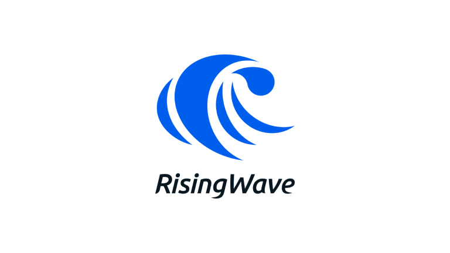
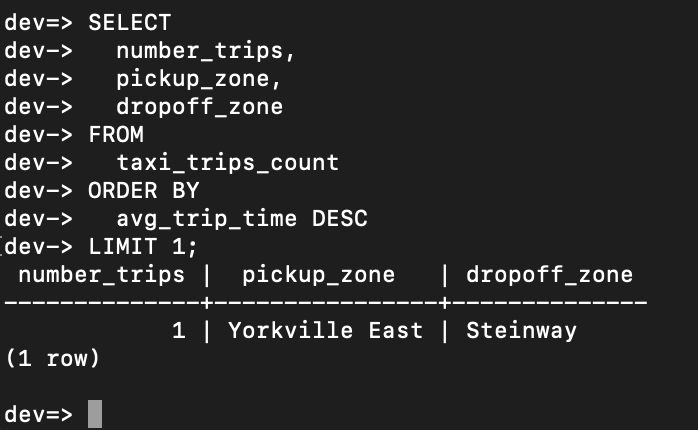
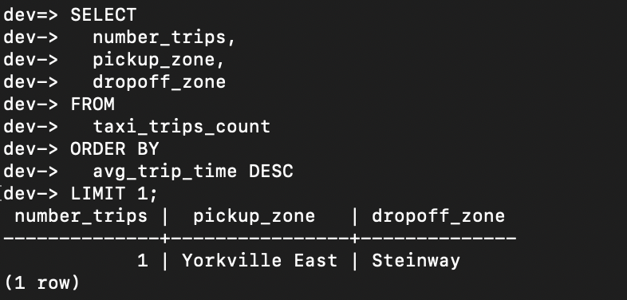
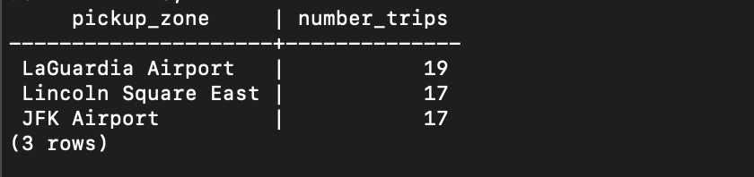

## Data Engineering Zoomcamp - Workshop 2 &#128640;

## Let's get started 
The project can be accessed through [DE Zoomcamp 2024 Workshop 2: Stream Processing with RisingWave](https://github.com/risingwavelabs/risingwave-data-talks-workshop-2024-03-04/tree/main)

## RisingWave

- More information on risingwave can be accessed via their official website [here](https://risingwave.com/)

- Risingwave could be a good choice if you're looking for

  -  Low latency/High throughput
  -  Having the need to query the a huge dataset from time to time. It consume computer power and potentially incurring higher cost in production. RisingWave able to help with this
  -  Incremental data that can be defined in SQL  

- Check out the medium article by me if you want to know more at [here](https://medium.com/@kangzhiyong1999/restructure-the-stream-processing-with-risingwave-ef04fb440fce).

## Workshop Homework &#128221;
The code for homework can be access [here](./homework.sql).

## Question 1. Highest average trip time

Pickup zone: Yorkville East, Dropoff zone: Steinway

## Question 2:  Number of trips

Number of trips: 1

## Question 3: Top 3 busiest zones

Busiet zone: LaGuardia Airport, Midtown Center, Upper East Side North